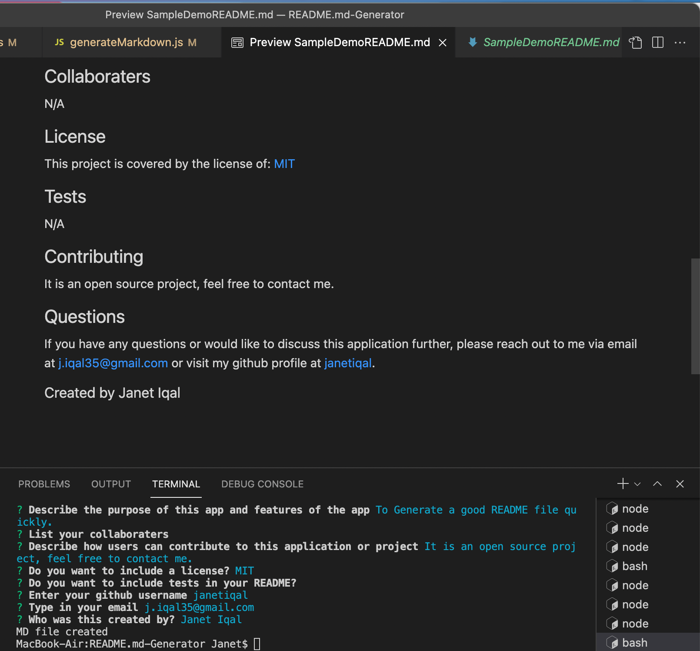

 # SampleDemo  
  
## Description 
  
This application dynamically generates a good README markdown file using the command line by using Node.js and the Inquirer Package.

## Table of Contents
- [Installation](#installation)
- [Usage](#usage)
- [Features](#features)
- [Demo](#demo)
- [ScreenShot](#screenshot)
- [Collaboraters](#collaboraters)
- [License](#license)
- [Tests](#tests)
- [Contributing](#contributing)
- [Questions](#questions)

## Installation
  Run npm i then node index.js in the terminal.
## Usage
  Open index.js in the integrated terminal and run node index.js
## Features 
  This application will give users the option to not sacrifice coding hours in order to create a thorough README. 
## Demo Video
  Full video link to demo [here](https://drive.google.com/file/d/1g3L_BXFhcPYMHs2HKLuRUfNGHAVWicDQ/view?usp=sharing).   
  
  
## Screenshot
  

## Collaboraters
  N/A
## License 
  This project is covered by the license of: [MIT](https://opensource.org/licenses/MIT)
## Tests
  N/A
## Contributing 
  It is an open source project, please contact me to be added as a contributor.
## Questions
  If you have any questions or would like to discuss this application further, please reach out to me via email at [j.iqal35@gmail.com](mailto:j.iqal35@gmail.com) or visit my github profile at [janetiqal](http://www.github.com/janetiqal).

### Created by Janet Iqal
